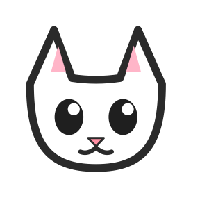
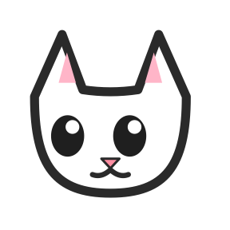
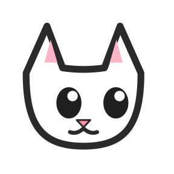
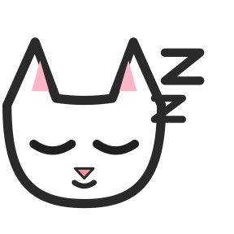

# watchCat 🐱

[](LICENSE)
[](https://claude.com/claude-code)
[](#빌드)

**맥 사용시간 자동 기록기** — 상태바의 마스코트가 기록 상태를 직관적으로 보여주는 macOS 메뉴바 앱.

> 🛠️ 이 프로젝트는 [Claude Code](https://claude.com/claude-code)를 활용해 단독 개발한 **오픈소스(MIT)** 앱입니다. 명세 작성부터 SwiftUI/GRDB 구현, 시스템 연동, Homebrew 배포까지 전 과정을 Claude Code와 함께 만들었습니다.

하루 동안 어떤 앱과 웹사이트에 시간을 쓰는지 백그라운드에서 자동으로 추적합니다. 잠금·슬립·자리비움 구간은 기록에서 제외해 데이터가 왜곡되지 않으며, 모든 데이터는 **로컬에만 저장**되고 외부로 전송되지 않습니다.

<p align="center">
  
  
  
  
</p>

---

## 주요 기능

- **상태바 마스코트** — 기록 중일 때 고양이가 고개를 좌우로 두리번거리고, 잠금/슬립/유휴/수동 중지 시 눈을 감고 `Zzz`를 띄웁니다. 시스템 '동작 줄이기'가 켜져 있으면 정적 아이콘으로 폴백합니다.
- **앱 사용시간 자동 기록** — 포그라운드 활성 앱을 번들 ID 기준으로 감지해 앱별 시간을 누적합니다. 전환 지연 ≤ 1초, 250ms 디바운스로 짧은 포커스 이동은 무시합니다.
- **웹페이지(탭) 기록** — Chrome · NAVER Whale · Safari의 활성 탭을 읽어 도메인 단위로 누적합니다(URL·제목은 옵트인). 인코그니토/시크릿 탭은 기본적으로 기록하지 않습니다.
- **비활성 구간 제외** — 화면 잠금, 슬립, 5분 입력 유휴(1~30분 설정 가능) 시 기록을 자동 중지하고 복귀 시 재개합니다. 셧다운 구간도 추적합니다.
- **대시보드** — 오늘/과거 일자별 앱·웹 사용 요약, 누적 활성도 곡선, '오늘의 리듬' 인사이트.
- **수동 카테고리화** — 생산성 / 커뮤니케이션 / 오락 / 기타 시드 카테고리로 앱을 분류해 합계를 확인합니다.
- **마스코트 7종** — 구름냥·치즈냥·노랑귀냥·방긋시바·잿빛곰·초롱부엉·느긋바라 중 설정에서 선택, 재시작 없이 즉시 교체됩니다.
- **완전 로컬 · 텔레메트리 없음** — `~/Library/Application Support/watchCat/`의 SQLite DB에만 저장(기본 보존 90일).

## 설치

### Homebrew Cask

```bash
brew tap hyunjoon0312/watchcat
brew install --cask watchcat
```

watchCat은 Apple Developer ID로 공증(notarize)되지 않았지만, Cask가 설치 후 quarantine 속성을 자동으로 제거하므로 별도 Gatekeeper 경고 없이 실행됩니다. 수동 설치 시 경고가 뜨면 `xattr -dr com.apple.quarantine /Applications/watchCat.app`로 해제하세요.

자세한 설치/제거 안내는 [dist/INSTALL.md](dist/INSTALL.md)를 참고하세요.

## 권한

첫 실행 시 온보딩 화면이 다음 권한을 순서대로 안내합니다. 권한을 모두 거부해도 앱은 '부분 동작 모드'로 유지되며, 설정에서 언제든 다시 부여할 수 있습니다.

| 권한 | 용도 |
|---|---|
| 접근성 (Accessibility) | 활성 앱 감지 |
| 화면 기록 (Screen Recording) | 활성 앱/창 식별 |
| 자동화 (Apple Events) | 브라우저 활성 탭 정보 읽기 |

## 빌드

Xcode 프로젝트는 [XcodeGen](https://github.com/yonaskolb/XcodeGen)으로 `project.yml`에서 생성합니다.

```bash
# 프로젝트 생성
brew install xcodegen   # 최초 1회
xcodegen generate

# Release 빌드
xcodebuild -project watchCat.xcodeproj -scheme watchCat \
  -configuration Release -derivedDataPath build-release -quiet
```

또는 `xcodegen generate` 후 `watchCat.xcodeproj`를 Xcode로 열어 실행합니다.

- **최소 OS**: macOS 14 Sonoma
- **언어/UI**: Swift 5 / SwiftUI
- **DB**: [GRDB](https://github.com/groue/GRDB.swift) on SQLite

마스코트 SVG 자산을 에셋 카탈로그(PNG @1x/@2x/@3x)로 재생성하려면 [`scripts/regen-mascot.sh`](scripts/regen-mascot.sh)를 실행합니다.

## 프로젝트 구조

```
watchCat/
├── StatusBar/      상태바 아이콘·마스코트 애니메이션·팝오버 메뉴
├── Recording/      활성 앱/브라우저 탭 추적, 유휴 감지, 세션 기록
├── Storage/        SQLite 세션 저장·집계(GRDB), 카테고리, 보존 정책
├── Dashboard/      사용 요약·활성도 곡선·인사이트 대시보드
├── Onboarding/     첫 실행 권한 온보딩
├── Permissions/    권한 상태 관리 및 재인증 안내
└── Settings/       설정 창·테마

assets/mascot/      마스코트 SVG 소스(캐릭터별 8프레임)
dist/               Homebrew Cask · 설치 안내 · 릴리스 산출물
SPEC.md             제품 명세 (기능 목록·수용 기준·검증 방법)
```

## 릴리스

새 버전 릴리스 절차(버전 갱신 → 빌드 → zip/해시 → 태그 → GitHub Release → Cask 갱신)는 [dist/INSTALL.md](dist/INSTALL.md)의 "새 버전 릴리스 절차"를 따릅니다.

## 개발

watchCat은 [Claude Code](https://claude.com/claude-code)를 활용해 1인 풀스택으로 개발했습니다. 활성 앱·브라우저 탭 추적, 잠금/슬립/유휴 구간 제외 같은 까다로운 macOS 시스템 연동부터 SwiftUI 대시보드, 권한 온보딩, Homebrew Cask 배포까지 Claude Code와 함께 반복 개발했습니다.

## 라이선스

[MIT License](LICENSE) © 2026 rian

오픈소스로 공개되어 있으며, 자유롭게 사용·수정·재배포할 수 있습니다. 기여(이슈·PR)를 환영합니다.
